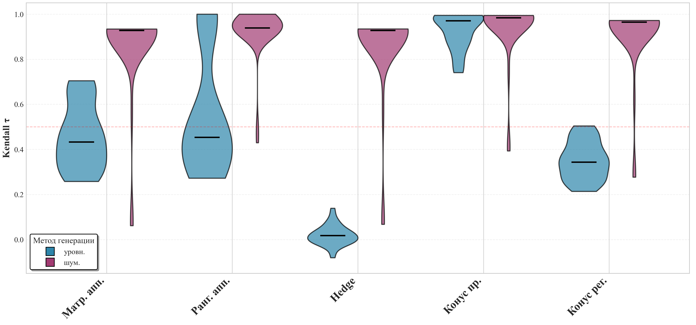
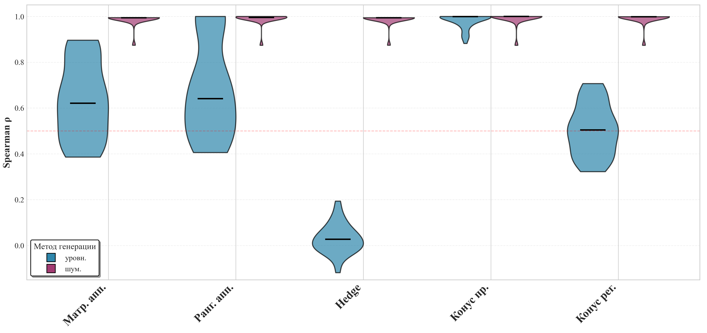
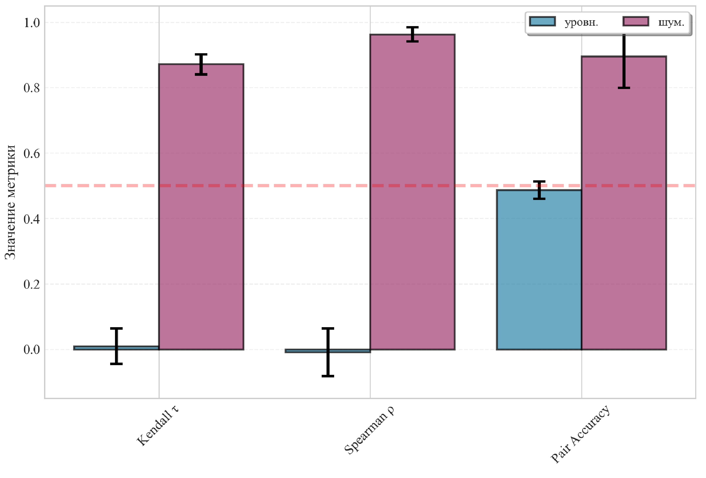

# Задача восстановления предпочтений на наборе объектов, заданных порядковым описанием

**Автор:** Булатов Даниил Вадимович  
**Научный руководитель:** к.ф.-м.н., доцент Д.В. Семенова  
**Направление:** 01.03.02 Прикладная математика и информатика  
**Институт:** ИМиФИ СФУ, кафедра высшей и прикладной математики  

> Данный репозиторий содержит программную реализацию и результаты сравнительного анализа методов восстановления предпочтений по порядковым экспертным оценкам.

---

## Актуальность темы

Области применения:
- рекомендательные системы и персонализация контента;
- математическая теория риска и финансовый риск-менеджмент;
- разработка показателей эффективности деятельности учреждений;
- обучение ранжированию объектов и обучение по предпочтениям;
- теория общественного выбора и агрегирования предпочтений без учителя;
- анализ экспертных оценок и согласование мнений.

---

## Цель и задачи исследования

**Цель:** обзор и анализ моделей предпочтений на наборе объектов, заданных порядковым описанием.

**Задачи:**
1. Исследовать существующие модели и программно реализовать их.
2. Разработать алгоритмы создания синтетических данных с контролируемыми параметрами.
3. Провести вычислительные эксперименты для сравнительного анализа методов.
4. Сформулировать рекомендации по выбору метода в зависимости от условий задачи.

---

## Основные определения и обозначения

| Обозначение | Описание |
|-------------|----------|
| $X = \{x_1, \dots, x_m\}$ | множество объектов |
| $z(x_i, x_k) = [x_i \succeq x_k]$ | отношение предпочтения |
| $(X, \succeq)$ | частично упорядоченное множество |
| $Z = (Z_{ik})$ | матрица частичного порядка, $Z_{ik} = z(x_i, x_k)$ |
| $R_i = \sum_{k=1}^m Z_{ik}$ | ранг объекта |
| $\mathbf{1}$ | единичный вектор-столбец |
| $\hat{Z}$ | восстановленная матрица предпочтений |

**Пример:** для отношения $\{x_1 \succeq x_2,\; x_2 \succeq x_3,\; x_2 \succeq x_4\}$ граф и матрица предпочтений:

```
x1 → x2 → x3
       ↓
       x4
```

```math
Z = \begin{bmatrix}
1 & 1 & 1 & 1 \\
0 & 1 & 1 & 1 \\
0 & 0 & 1 & 0 \\
0 & 0 & 0 & 1
\end{bmatrix}
```

---

## Проблема согласованности экспертов

**Кластеризованная ранжировка** — объекты разбиты на кластеры (несравнимые альтернативы), между кластерами задан строгий линейный порядок.

Примеры:

$$z_1 = [1 < \{2, 3\} < 4 < \{5, 6, 7\} < 8 < 9 < 10]$$

$$z_2 = [\{1, 2\} < \{3, 4, 5\} < 6 < 7 < 9 < \{8, 10\}]$$

**Ядра противоречий:**
- *Сильное противоречие:* $x_i < x_k$ в одной ранжировке и $x_i > x_k$ в другой.
- *Слабое противоречие:* различается упорядоченность или эквивалентность.

**Согласование** двух ранжировок даёт, например:

$$f(z_1, z_2) = [1 < 2 < 3 < 4 < 5 < 6 < 7 < \{8, 9\} < 10]$$

Каждая кластеризованная ранжировка может быть представлена матрицей предпочтений $Z$, где

```math
z_{ij} = \begin{cases}
1, & \text{если } x_i < x_j \text{ или } x_i = x_j, \\
0, & \text{иначе}.
\end{cases}
```

---

## Постановка задачи восстановления предпочтений

**Дано:**
- множество объектов $X = \{x_1,\dots,x_m\}$;
- набор экспертных предпочтений $z_1,\dots,z_n$ на $X$: $z_j(x_i,x_k) = [x_i \succeq_j x_k]$;
- целевое отношение предпочтения $z_0(x_i,x_k) = [x_i \succeq x_k]$, которое требуется аппроксимировать.

**Найти:** отображение $f: X \to \mathbb{R}$, задающее агрегированное отношение предпочтения $z_f$, такое что:
- наилучшим образом приближает целевое предпочтение $z_0$:

```math
S(X, z_f, z_0) \to \min_f,
```

где $S$ — функция ошибки;
- удовлетворяет условию монотонности:

$$x_i \succeq_1 x_k,\dots,x_i \succeq_n x_k \;\Rightarrow\; f(x_i) \ge f(x_k).$$

---

## Методы восстановления предпочтений

В работе рассмотрены и реализованы следующие методы:

| Метод | Функция ошибки | Особенности |
|-------|----------------|-------------|
| Матричная аппроксимация | $\|Z_0 - \sum w_j Z_j\|^2$ | Отрицательные веса |
| Ранговая аппроксимация | $\|R_0 - \sum w_j R_j\|^2$ | Отрицательные веса |
| Коэн – Шапира – Зингер (Hedge) | $\frac{1}{\|F_t\|} \sum(1 - Z_j(u,v))$ | Онлайн, $w_j \ge 0$ |
| Конусный (прямой) | $\|Z_0\mathbf{1} - \sum Z_j\lambda_j\|^2$ | $O(Knm^3)$, $\lambda_j \ge 0$ |
| Конусный (регуляризованный) | $\|Z_0 - \hat{Z}\|_F^2 + \|Z_0\mathbf{1} - \hat{Z}\lambda\|_2^2$ | $\lambda \ge 0$ |
| Граф большинства | — | Без учителя |

### Краткое описание каждого метода

#### 1. Матричная аппроксимация

Минимизация квадратичной невязки между целевой матрицей и взвешенной суммой матриц экспертов:

```math
\hat{w} = \arg\min_{\mathbf{w}} \sum_{i,k} \left( Z_0^{(i,k)} - \sum_{j=1}^{n} w_j Z_j^{(i,k)} \right)^2.
```

Веса могут быть отрицательными (интерпретируются как противоположное мнение).  
**Алгоритм:** векторизация матриц → решение МНК → восстановление матрицы → бинаризация с порогом $\tau_{\text{tol}}$.  
**Сложность:** время $O(n^2 m^2 + n^3)$, память $O(n \cdot m^2)$.

#### 2. Ранговая аппроксимация

Минимизация невязки между вектором целевых рангов и взвешенной суммой векторов рангов экспертов:

```math
\hat{w} = \arg\min_{\mathbf{w}} \sum_{i=1}^{m} \left( R_0^{(i)} - \sum_{j=1}^{n} w_j R_j^{(i)} \right)^2.
```

Ранги вычисляются как суммы строк матриц.  
**Сложность:** время $O(m n^2 + n^3 + m^2)$, память $O(n m + m^2)$.

#### 3. Метод Коэна – Шапира – Зингера (Hedge)

Двухэтапный подход: сначала веса экспертов обучаются на обратной связи (попарные сравнения из $Z_0$), затем строится итоговое ранжирование.  
Функция потерь на раунде $t$:

```math
\ell_j^{(t)} = \frac{1}{|F_t|} \sum_{(u,v)\in F_t} (1 - Z_j(u,v)).
```

После обучения строится агрегированная матрица $\hat{Z} = \sum w_j Z_j$, затем применяется алгоритм **Order-By-Preferences** с кластеризацией.  
**Сложность:** время $O(n m^2 + m^2)$, память $O(n m^2)$.

#### 4. Прямой конусный метод

Модель ищется в виде неотрицательной комбинации столбцов матриц экспертов:

$$f = \sum_{j=1}^{n} Z_j \lambda_j,\quad \lambda_j \ge 0,$$

```math
(\hat{\lambda}_1,\dots,\hat{\lambda}_n) = \arg\min_{\lambda_j \ge 0} \|Z_0\mathbf{1} - \sum_{j=1}^{n} Z_j\lambda_j\|^2.
```

Гарантирует свойство монотонности.  
**Алгоритм:** итеративное решение ННК для каждого эксперта.  
**Сложность:** время $O(K \cdot n \cdot m^3)$, память $O(n \cdot m^2)$.

#### 5. Регуляризованный конусный метод

Каждый конус заменяется центральной точкой (вектором построчных сумм). Двухэтапная процедура:
- найти неотрицательные веса $w_j$ для аппроксимации $Z_0$ через $\sum w_j Z_j$;
- найти нормированный вектор $\lambda$ для аппроксимации $Z_0\mathbf{1}$ через $\hat{Z}\lambda$.

$$\hat{Z} = \sum_{j=1}^{n} w_j Z_j,\quad w_j \ge 0,$$

```math
\hat{\lambda} = \arg\min_{\lambda \ge 0,\; \sum \lambda = 1} \|Z_0\mathbf{1} - \hat{Z}\lambda\|^2.
```

**Сложность:** время $O(n^2 m^2 + n^3 + m^3)$, память $O(n m^2)$.

#### 6. Метод графа большинства

Агрегирование на основе правила простого большинства **без** целевой матрицы.  
**Алгоритм:**
- построить матрицу весов $W_{ik} = \sum_{j=1}^{n} (Z_j(i,k) - Z_j(k,i))$;
- построить взвешенный граф (дуга $i\to k$, если $W_{ik}>0$);
- выполнить жадную топологическую сортировку с приоритетом по сумме положительных весов.

**Применение:** обучение без учителя, устойчивость к несогласованным предпочтениям.  
**Сложность:** время $O(n m^2 + m^2)$, память $O(m^2)$.

---

## Программная реализация

**Стек:**
- Python 3.10
- NumPy, SciPy (ННК, линейная алгебра)
- Matplotlib (визуализация)
- tqdm, multiprocessing

**Модули:**
- `utility.generator` — генерация данных, преобразования, метрики
- `methods.aggregate_graph` — граф большинства
- `methods.bulatov_naive` — матричная и ранговая аппроксимации
- `methods.cohen_greedy` — модифицированный Hedge + Order-By-Preferences
- `methods.kuznets_cone` — прямой и регуляризованный конусные методы

---

## Генерация синтетических данных

Три подхода с контролируемыми параметрами:

1. **Прямое случайное предпочтение** – для каждой пары объектов с вероятностью $p$ задаётся $x_i \succeq x_k$, с вероятностью $p$ — $x_k \succeq x_i$, с вероятностью $1-2p$ — эквивалентность.

2. **Иерархические уровни** – объекты распределяются по уровням, доминирование от вышестоящих к нижестоящим.

3. **Внесение шума** – в эталонный линейный порядок с вероятностью $q$ инвертируется отношение между парами.

> Создание матриц с заданной степенью согласованности является вычислительно трудоёмкой задачей, поэтому используются эвристические методы.

---

## Метрики оценки качества

| Метрика | Формула | Назначение |
|---------|---------|------------|
| $\tau$ Кендалла | $\displaystyle 1 - \frac{4}{m(m-1)}\sum_{i<j} I[Z_1(i,j) \neq Z_2(i,j)]$ | Согласованность по инверсиям |
| $\rho$ Спирмена | $\displaystyle 1 - \frac{6}{m(m^2-1)}\sum_{i=1}^{m}(R_i - L_i)^2$ | Связь по разности рангов |
| Accuracy | $\displaystyle \frac{1}{m(m-1)} \sum_{i \neq j} I[\text{sign}(\hat{Z}(ij)-\hat{Z}(ji)) = \text{sign}(Z(ij)-{Z}(ji))]$ | Доля пар, для которых предсказанный порядок совпадает с истинным |
---

## Режимы сравнения методов

- **Честный режим**: фиксированный порог $\tau_{\text{tol}}$:  
  - для наивных методов и Hedge: $\tau_{\text{tol}} = 0.6$ (эмпирически);  
  - для конусных методов: $\tau_{\text{tol}} = 0$ (согласно исходной идее).

- **Идеальный режим**: порог подбирается жадным перебором на обучающей выборке для максимизации $\tau$ Кендалла. Показывает потенциал метода, но не применим к новым данным.

---

## Результаты экспериментов

### Основное сравнение ($m=75$, $n=50$, честный режим)

| Метод | Kendall $\tau$ | Spearman $\rho$ | Pair Accuracy | Время (с) |
|-------|----------------|-----------------|---------------|-----------|
| **Конусный пр.** | **0.9398** | **0.9954** | **0.9488** | 9.72 |
| Ранговая апр. | 0.9040 | 0.9894 | 0.9285 | 0.58 |
| Конусный рег. | 0.8909 | 0.9911 | 0.9335 | 0.55 |
| Коэн – Шапира – Зингер | 0.8510 | 0.9828 | 0.9128 | 0.63 |
| Матричная апр. | 0.8507 | 0.9835 | 0.9144 | 0.57 |

**Выводы:** прямой конусный метод даёт наилучшее качество, но медленнее других в 17–18 раз. Регуляризованный конусный и ранговая аппроксимация показывают близкое качество при значительно меньшем времени.

### Влияние генерации данных

| Метод | $\tau$ (прямая) | $\tau$ (шум) |
|-------|----------------|--------------|
| Конусный пр. | 0.0865 | 0.9398 |
| Ранговая апр. | 0.0840 | 0.9040 |
| Конусный рег. | 0.0562 | 0.8909 |

На данных с прямым случайным предпочтением все методы показывают очень низкий $\tau$ из-за отсутствия структуры. На данных с шумом качество высокое.

### Графовый метод большинства (без учителя)

| Генерация | Kendall $\tau$ | Spearman $\rho$ | Pair Accuracy | Время (с) |
|-----------|----------------|-----------------|---------------|-----------|
| уровневая | 0.0093 | -0.0094 | 0.4865 | 0.48 |
| зашумление | 0.8713 | 0.9626 | 0.8953 | 0.44 |

Графовый метод показывает хорошее качество только на структурированных (зашумленных) данных.

### Распределение метрик по методам

Ниже приведены ящики с усами для коэффициентов Кендалла и Спирмена в честном режиме (из презентации):

  
*Рис. 1 – Распределение Kendall tau по методам*

  
*Рис. 2 – Распределение Spearman rho по методам*

  
*Рис. 3 – Средние показатели метрик графового метода для разных генераторов*

---

## Общие тенденции

- Качество восстановления снижается с ростом числа объектов.
- Методы по-разному реагируют на размерность: одни ухудшаются плавно, другие – резко.
- С ростом размерности разрыв в эффективности становится значительным.
- Ранговые методы робастнее к шуму, чем матричные.
- Подбор порога кластеризации существенно улучшает качество для конусных методов.

---

## Практические рекомендации по выбору метода

| Сценарий | Рекомендуемый метод | Ключевые показатели |
|----------|---------------------|----------------------|
| Максимальная точность | Конусный прямой | $\tau = 0.94$ |
| Баланс точности и скорости | Ранговая аппроксимация | $\tau = 0.90$, время < 0.6 с |
| Интерпретируемость весов | Конусный регуляризованный | время ≈ 0.55 с |
| Неполная обратная связь | Hedge (Коэн – Шапира – Зингер) | работает без полной матрицы |
| Нет целевой матрицы | Граф большинства | $\tau = 0.87$ (на шумовых данных) |

---

## Заключение

В ходе работы:
- Реализован комплекс программ на Python, включающий пять методов восстановления предпочтений.
- Разработаны процедуры преобразования между матрицами, рангами и кластеризованными ранжировками.
- Реализован жадный подбор оптимального порога кластеризации.
- Созданы алгоритмы генерации синтетических данных.
- Сформулированы рекомендации по выбору метода.

---

## Апробация

Результаты работы представлены на конференциях:
1. XXI Международная научная конференция студентов, аспирантов и молодых учёных «Проспект Свободный – 2025» (Красноярск, 21–26 апреля 2025 г.).
2. Открытая конференция молодых учёных по математическому моделированию, информационным технологиям и фундаментальной математике ИВМ СО РАН 2026 (Красноярск, 12 марта 2026 г.).
3. XXII Международная научная конференция студентов, аспирантов и молодых учёных «Проспект Свободный – 2026» (Красноярск, 20–25 апреля 2026 г.).

---

## Литература

1. Кузнецов М.П. Построение моделей обучения по предпочтениям с использованием порядковых экспертных оценок: Дис. канд. физ.-мат. наук. — М.: МФТИ, 2016. — 103 с.
2. Cohen W.W., Schapire R., Singer Y. Learning to Order Things // Advances in Neural Information Processing Systems. 1997. Vol. 10. P. 451–457.
3. Bartholdi III J.J., Tovey C.A., Trick M.A. Voting schemes for which it can be difficult to tell who won the election // Social Choice and Welfare. 1989. Vol. 6, No. 2. P. 157–165.
4. Kendall M.G. Rank Correlation Methods. — 4th ed. — London: Griffin, 1970. — 210 p.

